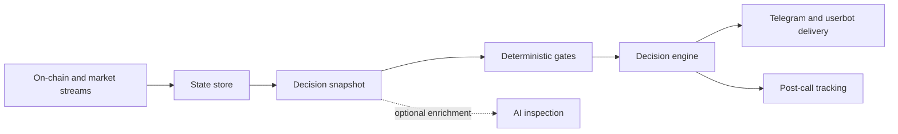

# Apex AI

Apex AI was my first attempt at building an agent around a genuinely live
environment. It observes fast Solana token migrations, builds state from market
events, applies deterministic decision rules, and delivers time sensitive
inspections and alerts.

The project predates Leverage and established many of the engineering patterns
later reused across Blueprint Labs.

## Why I Built It

I wanted to understand how AI could contribute to a rapidly changing market
without putting a language model directly inside the latency critical event
loop.

## How the System Works

## Core Ideas

### Stateful streaming

Individual events are not useful in isolation. Apex maintains token-level state
covering market activity, participants, timing, migration progress, and other
observations before taking a decision snapshot.

### Deterministic hot path

The event loop must continue processing while slower work happens. Validation,
AI inspection, network delivery, and outcome tracking run asynchronously when
possible.

### Observable decisions

A decision should be reconstructable later. Apex stores snapshots, decisions,
signals, inspection results, and post-call outcomes instead of preserving only
the Telegram message.

### Data-source resilience

Live systems encounter dropped subscriptions, quota limits, stale feeds, and
partial state. Apex includes stream-health monitoring, fallback paths, retries,
and explicit untracked-event handling.

## What It Taught Me

- Keep model reasoning away from mechanical truth.
- Persist the state that produced a decision.
- Publish alerts asynchronously so one integration cannot block the system.
- Treat missing data as a first-class state rather than silently guessing.
- Track what happened after the call.
- User-facing clarity matters when decisions are time-sensitive.

## Current Status

Apex is active production research. Its repository contains the operational
implementation; this dossier records the agent-design lessons rather than
duplicating proprietary or environment-specific code.
