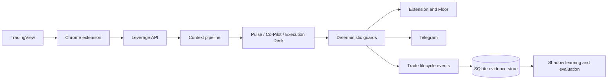

# Leverage

Leverage is the project that pushed me from experimenting with model responses
into building a complete agent system. I wanted to know what a trading agent
would need if it had to work beside a person, observe a live chart, remember the
current situation, and remain accountable for what happened later.

It began as a browser extension that could read a TradingView chart. It evolved
into a distributed system with a Chrome capture layer, a Go backend, model
workflows, deterministic guards, Telegram delivery, a three-dimensional trading
floor, journals, outcome tracking, and a shadow learning system.

## Why I Built It

The main question is simple: can a multimodal agent become a useful trading
partner without pretending that model confidence is market truth?

That question created several smaller ones:

- How should chart images and structured prices be reconciled?
- How can periodic scans preserve state without becoming anchored to an old
  thesis?
- Which decisions belong to the model, and which must be deterministic?
- How should calls be evaluated when the user may not take them?
- Can lessons be learned safely without contaminating future prompts?
- How should a professional trader debate, correct, and work with the agent?

## How It Is Split Up

### Pulse

Pulse periodically analyses a selected chart and can produce `TAKE`, `WAIT`,
`UNCLEAR`, or management states. It receives the current chart, standing market
map, live context, news, calendar events, prior setup state, and deterministic
guard output.

### Co-Pilot

Co-Pilot is the conversational professional workflow. It can inspect the live
chart on demand or through Watch mode, discuss a trader's own drawings and
position tools, suggest market or limit plans, and preserve a session-level
conversation.

### Market Map

The map captures Daily and 4H context separately from the 15-minute execution
chart. It records higher-timeframe structure, zones, liquidity, invalidation,
and capture provenance. Freshness follows candle boundaries rather than an
arbitrary timer.

### Execution Desk

Execution Desk is an optional second opinion. It audits an existing Pulse setup
without delaying, replacing, or inventing another signal.

### Trade Monitor

Trade Monitor combines deterministic post-entry observations with model-based
management. Mechanical price crossings own TP and SL truth. The model may
recommend an early exit, protection, or continued holding, but it cannot turn a
historical chart wick into a new outcome event.

### The Floor

The Floor visualises the system as a working desk rather than a collection of
background jobs. It includes live agent state, calls, communications, maps,
journals, calendars, feeds, scans, paper outcomes, and learning diagnostics.

## Architecture

## What the Agent Actually Receives

- Current TradingView chart image and visible chart metadata.
- Daily and 4H Market Map images and structured zones.
- Asset-specific market snapshots.
- Economic-calendar events and desk-specific notes.
- Recent market news with freshness information.
- Session state, prior reads, and the active trade plan.
- Deterministic risk/reward and lifecycle guards.
- For management, post-entry tracker evidence and progress toward targets.

The model is not permitted to treat every source equally. Current visual
structure and trusted live observations override stale summaries. Mechanical
outcome detection remains outside the model.

## How I Measure It

Leverage records:

- Immutable analysis episodes.
- Model and prompt versions.
- Structured setup fields and context metadata.
- Paper calls separately from user-taken trades.
- Idempotent lifecycle events.
- T1, T2, stop, close, and ambiguity timestamps.
- Dollar P&L, realized R, MFE, and MAE when available.
- Which approved memories would have matched an analysis.

The Playbook Memory system is intentionally disabled for live prompt injection.
Candidate lessons require evidence, review, and owner approval. A single trade
can propose a lesson but can never activate it.

## Lessons From Building It

### The screenshot is evidence, not ground truth

A management screenshot contains candles from before and after entry. Without a
trusted post-entry timestamp, an old wick can look like a new TP or SL. Outcome
truth therefore belongs to the tracker, not visual inference.

### More context can still produce worse reasoning

Passing a market map is not enough. The system must say how fresh it is, which
asset it belongs to, whether it conflicts with the live chart, and whether a
zone is context or prohibition.

### A target zone is not one exact price

Waiting for the far edge of a target zone can turn a completed plan into a
giveback. The evaluation system now distinguishes T1 and T2 and is being used to
study partial exits and runners.

### Confidence needs calibration

Low, medium, and high labels were not sufficiently informative. The current
interface exposes an evidence-backed confidence profile while keeping it
advisory rather than using it as a hard trade gate.

### UI is part of cognition

The side panel, management card, map, timeline, and Floor affect how quickly a
human understands the recommendation and notices a contradiction. Interface
work is not decoration around the model.

## Current Status

- Private beta and active live evaluation.
- BTC and gold workflows are evaluated separately.
- Paper and taken cohorts are not combined.
- Memory retrieval and candidate extraction are shadow-only.
- Outcome quality is improving, but historical records still contain ambiguity
  and are not presented as a verified performance claim.
- Public `Leverage Live` observability is a research direction, not a shipped
  product.

## Scope

Leverage is experimental decision-support software. It does not guarantee
profitability, and its outputs are not financial advice. Real market outcomes,
execution, spreads, slippage, user management, and incomplete data can all
diverge from the displayed plan.
